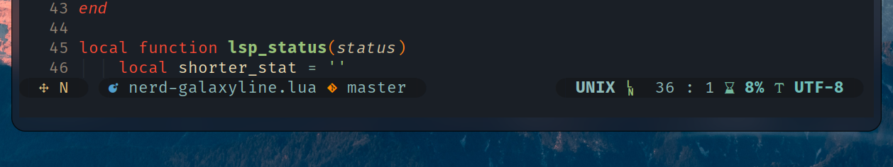
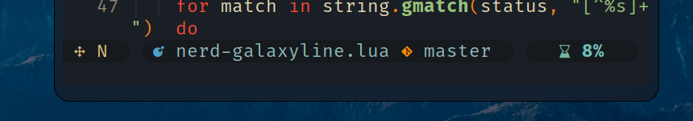

# nerd-galaxyline



nerd-galaxyline is a modern and great-looking status bar theme for 
[galaxyline](https://github.com/glepnir/galaxyline.nvim). Forked from
[evilline](https://github.com/LoydAndrew/nvim/blob/main/evilline.lua)
and have numerous changes been made in the appearance.

## Features

- Support `coc.nvim` diagnostic information report.
- Full nerdfont icons.
- Looks well with vim-deus themes.
- Support auto shrink size



## Requirement

Requires neovim 0.5.0+ and a patched
[nerd font](https://www.nerdfonts.com/).

You may also need [neovim-deus](https://github.com/Avimitin/neovim-deus)
to get the full colorscheme look.

## Install

Using [vim-plug]()

```
Plug 'glepnir/galaxyline.nvim'
Plug 'Avimitin/nerd-galaxyline'
```

## License

MIT LICENSE

